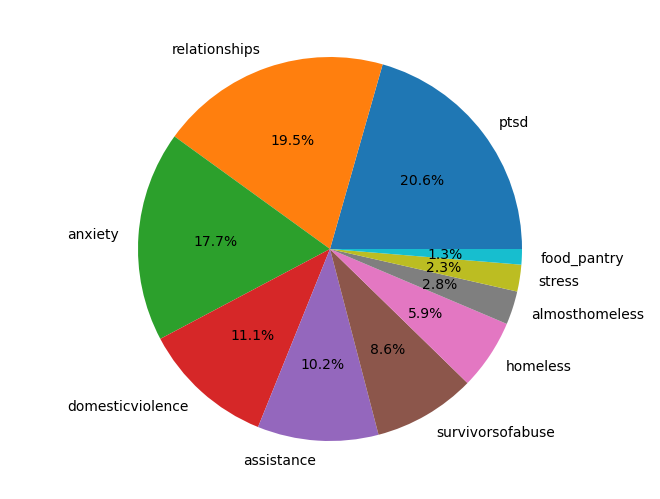
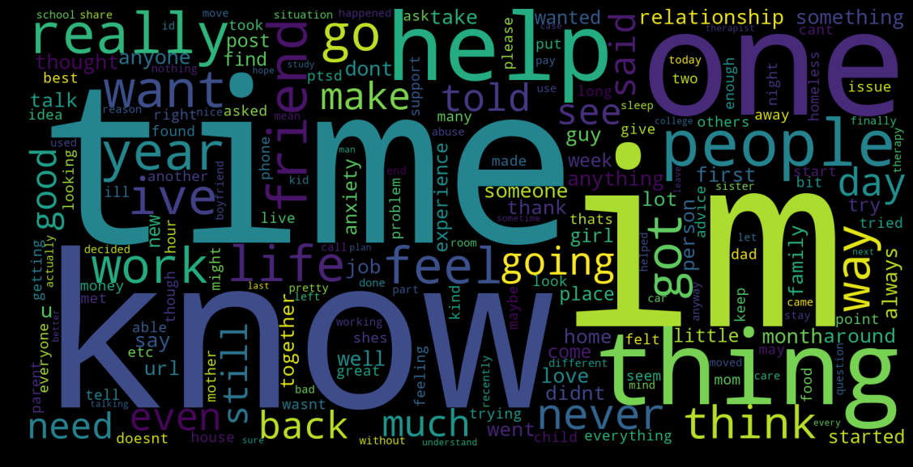
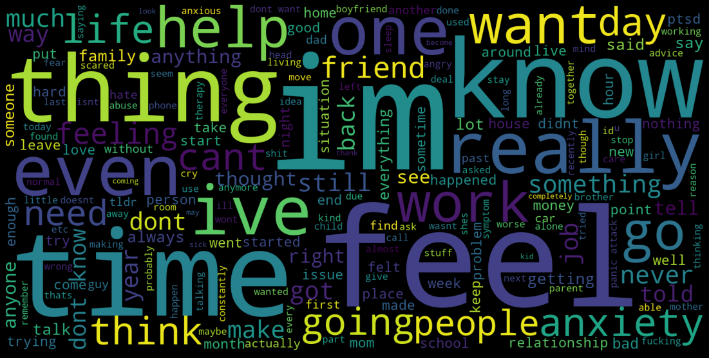

# Stress In Social Media

This is a research project aimed at recognizing patterns of stress in social media usage.
We use several AI techniques to build reliable, robust classification models for identifying stress based on dozens of lingustic parameters.

## Dataset
----
This project relies on the Dreaddit dataset, which is a compilation of data across several stress related subreddit communities such as r/anxiety, r/ptsd and so on. The distribution of posts across different categories is as follows:

The posts are labelled as stress/non-stress (0/1), and therefore enables us to use supervised classification models. We are also provided feature extraction using LIWC.

Although the dataset is relatively small (~3600 rows), it is a good stepping stone for further research.

## Approaches
---
The labelled dataset allows us to use different approaches for supervised learning. We not only explore different machine learning models, but also implement our own feature extraction on the dataset.

### Naive Bayes
---
This was a preliminary approach which we used to classify the text input such that the extracted features have an independent relationship to the prediction. In other words, this type of model does not consider the combined effect of multiple features on the classification.

This model gave us an accuracy of up to 75% but was highly inconsistent based on the test & training set state, and was sometimes as low as 45%. Clearly, we can improve on this. 

### Support Vector Machine
---
SVMs help avoid issues such as overfitting and are therefore a powerful tool. We used a linear kernel SVM to fit our data.

A basic SVM Classification model gave us consistent results in the 70-80% range. This was a great improvement from the naive bayes model.

### Logistic Regression
---
To fit our dataset more accurately, we implemented a logistic classification model. Using a sigmoid activation function improved the accuracy considerably.

This model gave us consistent accuracy of over 75%, a great improvement from the SVM model.

### Artificial Neural Network
---
Given the large number of input parameters, we wanted to experiment with a deep learning approach that would utilize underlying relations between features. After auditing different artificial neural network configurations, we found that two hidden layers with 6 nodes each gave us the best results.

However, this did not quite improve on the previous models as most runs gave us an accuracy of 70-75%. Also, using a deep learning model is inherently much harder to explain and may be harder to avoid biases in.

## Custom feature extraction
---
With the limited availability of LIWC, we thought of building a feature extraction system from scratch using some NLP techniques.

### Bag of words

This method is a great way of corelating the occurences of specific words with the desired prediction. Consider the following word cloud visualizations for stressed and non-stressed text data from our dataset.

#### Non-Stressed Word Cloud

#### Stressed Word Cloud

Higher frequency of words such as "know", "time", "help" seem to indicate lack of stress. On the other hand, more occurences of words like "feel", "really", "thing" tend to indicate a stressed message.

Based on this principle, we built a bag-of-words model to count the frequency of words in the input text. These new "features" are now ready for use with any learning algorithm.

Coupling this with logisitic regression yielded an accuracy of 70-80%.

## Accuracy Breakdown
---
The overall accuracy for the different approaches are as follows:
- Naive Bayes: Inconsistent, 45% - 75%
- SVM: 70% to 80%
- Logistic Regression: 75% to 85%
- Artificial Neural Net: 70% to 75%
- Bag of Words + Logistic: 70% to 80%

## Conclusion
---
Based on the research and outputs we have seen so far, it is clear that a simple logistic regression approach has the potential to be a good solution for this challenge. 

Some factors that influenced model selection are:
1. Training & Run time
2. Ease of understanding of model
3. Modifications & trasformation of input dataset
4. Overfitting, Underfitting
5. Consistency of results across several training & testing datasets.
